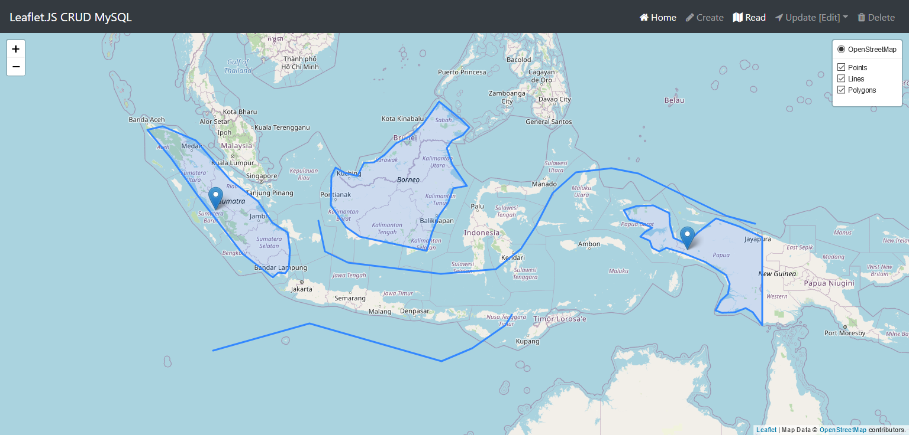

# leaflet-CRUD-MySQL

Leaflet.JS CRUD Implementation to MySQL

This repository adopts from [https://github.com/andyprasetya/leaflet-CRUD](https://github.com/andyprasetya/leaflet-CRUD)

This project uses [Leaflet](https://github.com/Leaflet/Leaflet), [Leaflet.Draw](https://github.com/Leaflet/Leaflet.draw), [ESRI Terraformer Core](http://terraformer.io/core/) and [ESRI Terraformer WKT Parser](http://terraformer.io/wkt-parser/); while at the backend it uses [PHP](http://php.net/) and [MySQL](https://www.mysql.com/).

Demo: [https://leafletcrudmysql.unsorry.net/](https://leafletcrudmysql.unsorry.net/)

`unsorry@2020`
